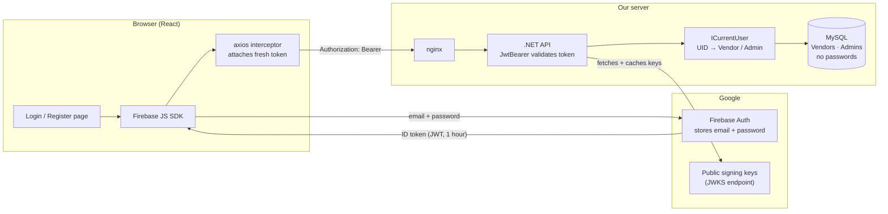
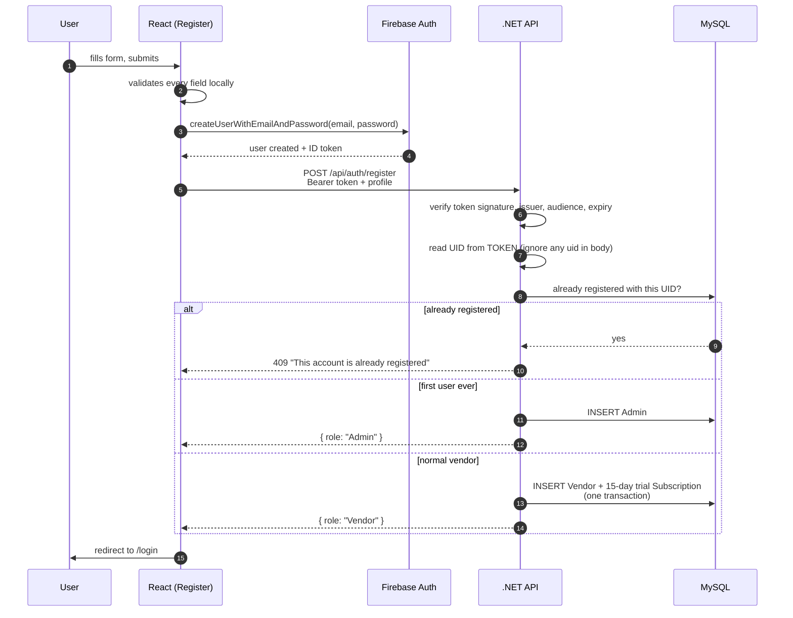
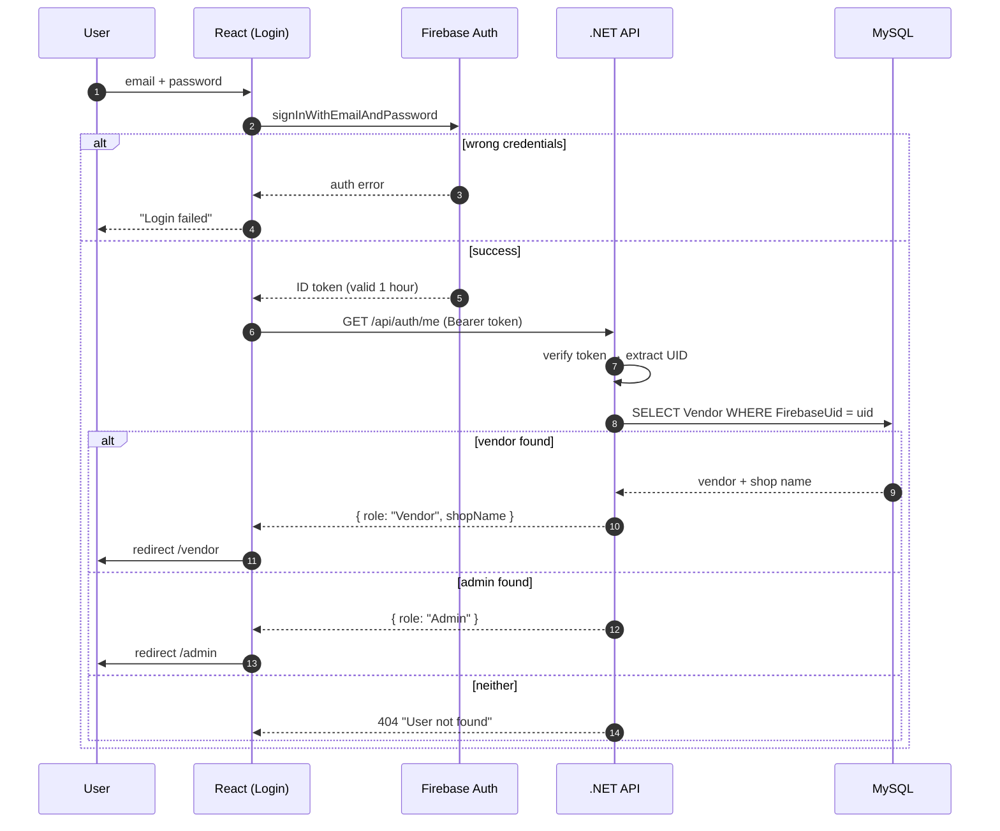
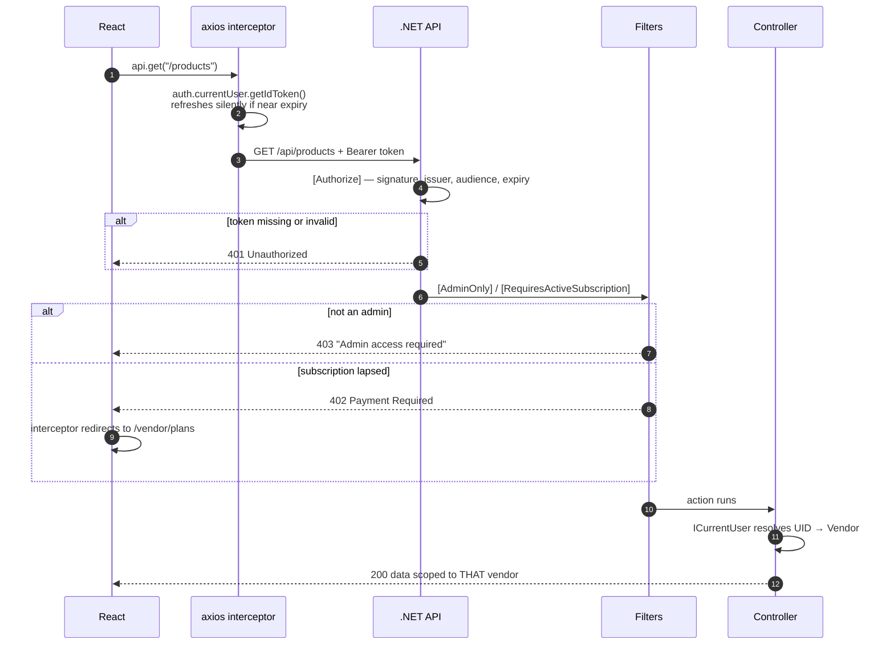
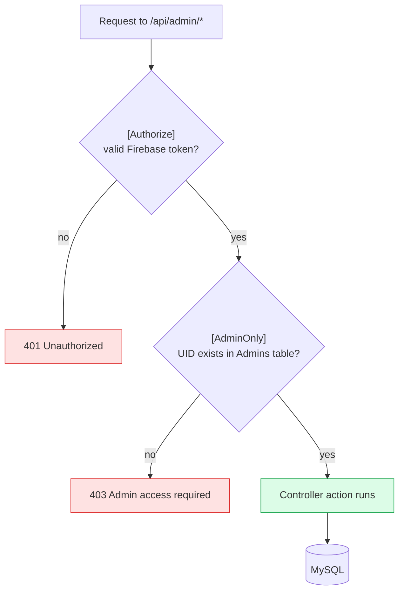
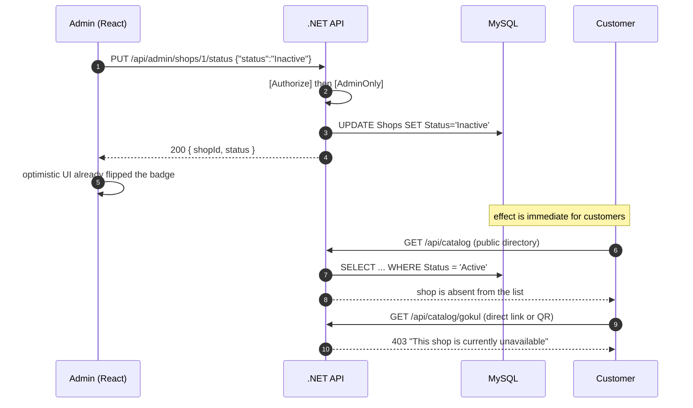

# Auth & Admin Modules — Deep Dive

Detailed speaking script and flow diagrams for the **Authentication** and
**Admin** modules of ScanStore.

> `[SLIDE]` / `[DEMO]` are stage directions. Everything else is what you say.
> Diagrams below are Mermaid — they render on GitHub directly.

---

# PART A — Authentication Module

**~6–7 minutes**

## A1. The opening claim

[SLIDE: "We do not store passwords"]

> I'm covering how ScanStore knows who you are.
>
> The single most important thing about our authentication: **we never store a
> password.** There is no password column anywhere in our schema — you can check
> `information_schema` and get nothing back. If somebody stole our entire
> database tomorrow, they would not get a single credential.
>
> We do that by delegating identity to **Firebase Authentication**. Firebase
> holds the email and password. We hold the shop data. The two are linked by one
> value — the Firebase **UID**.

[PAUSE]

> That's the design. Now let me show you the three flows that use it:
> registration, login, and an ordinary authenticated request.

## A2. Architecture overview

[SLIDE: diagram below]

> Read it left to right. The browser sends credentials to **Firebase**, not to
> us. Firebase returns a signed token. Our API verifies that signature using
> Google's **public keys** — which means we can prove the token is genuine
> without ever holding a secret and without calling Google on every request.

## A3. Registration flow

[SLIDE: diagram below]

> Walk through it.
>
> The user fills in the form. Every field validates in the browser first — full
> name, Aadhaar, phone, matching passwords.
>
> **Step 3 is the important one.** The client creates the account with *Firebase*
> first, not with us. So by the time our API is called, the user already exists
> and is already authenticated.
>
> Then we call our own `/auth/register` with the profile — name, phone, Aadhaar,
> address — and the token attached.

[SLIDE: highlight the UID line]

> **Step 7 is the security decision worth explaining.** The request body contains
> a `firebaseUid` field. We **ignore it.** We read the UID out of the verified
> token instead.
>
> Why? Because if we trusted the body, I could sign up, then send a request with
> *your* UID in it, creating a vendor row that points at your Firebase account.
> Next time you logged in, the API would resolve your token to my shop. Reading
> the UID from the signed token makes that impossible — you cannot forge a
> Google signature.

[PAUSE]

> Two more things happen here. **The first user ever registered becomes the
> Admin** — that's how the platform bootstraps, with no seeded credentials
> shipped in the code. Everyone after is a Vendor.
>
> And every new vendor gets a **15-day free trial created in the same database
> transaction**. Same transaction deliberately: if the trial insert failed
> separately, we'd have a vendor who can't use anything, because access is
> decided purely by whether a subscription term is running.

## A4. Login flow

[SLIDE: diagram below]

> Login is two steps, and it's worth being precise about which does what.
>
> **Firebase checks the password.** If it's wrong, we never even hear about it.
>
> **Our API decides the role.** The client calls `/auth/me` with the token, we
> resolve the UID against the `Vendors` table, then the `Admins` table, and
> return the role. The React app routes to `/vendor` or `/admin` based on that.

[SLIDE: highlight the 404 branch]

> That last branch is worth calling out because we hit it in practice. If
> Firebase authenticates you but there's no matching row, you get **"User not
> found."** That happens when the account exists in Firebase but not in *that*
> database — for example after deploying to a fresh server with an empty
> database. It's not a bug; it's the two systems telling you they disagree.

## A5. An ordinary authenticated request

[SLIDE: diagram below]

> Every request carries a token, and the interceptor calls `getIdToken()` rather
> than reading the copy in localStorage. That matters: Firebase tokens expire
> after **one hour**, and `getIdToken()` silently exchanges the refresh token
> when it's close. Reading the stale copy would mean an instant 401 an hour into
> a session.

[SLIDE: the four status codes]

> Notice the four different answers, because they mean different things:
>
> - **401** — you are not signed in, or your token is invalid or expired.
> - **403** — you *are* signed in, but you're not an admin.
> - **402** — you're a valid vendor whose subscription has lapsed. The client
>   intercepts this and sends you to the pricing page, so you're never left
>   clicking Save against an error you can't act on.
> - **200** — and the data is scoped to *your* vendor id, resolved from the
>   token.

> That last point is the whole authorization model: a controller never trusts an
> id from the URL or the body. It asks `ICurrentUser`, which reads the UID from
> the signed token and looks up the row. So there is no request you can craft
> that returns another vendor's products.

### Auth Q&A prep
- *"Why not JWT of your own?"* → We'd have to store password hashes, build reset flows, and rate-limit brute force. Firebase does all three, and a database breach exposes no credentials.
- *"What if Firebase is down?"* → Nobody can log in, but existing tokens stay valid for up to an hour and the public catalog is unaffected — it needs no auth at all.
- *"Where is the token stored? Isn't localStorage unsafe?"* → It's in memory via the Firebase SDK, mirrored to localStorage for the first paint after a reload. It expires in an hour. The honest caveat: localStorage is readable by XSS — cookies with HttpOnly would be stronger, and that's a known improvement.
- *"Can someone register as Admin?"* → Only if they're the first ever user. After that every registration is a Vendor, and there's no endpoint to promote anyone.

---

# PART B — Admin Module

**~5–6 minutes**

## B1. What an admin is for

[SLIDE: admin responsibilities]

> The admin is the **platform operator**, not a super-vendor. They don't create
> products or manage a shop. They do three things: see the state of the
> platform, review who's on it, and take a shop offline if they have to.

## B2. Two locks, not one

[SLIDE: diagram below]

> Every admin endpoint passes **two** checks, and they're deliberately separate.
>
> `[Authorize]` proves you're signed in — a valid, unexpired, Google-signed
> token. Fail that and you get **401**.
>
> `[AdminOnly]` is our own authorization filter. It takes the UID from that
> token and checks whether it exists in the **Admins** table. Fail that and you
> get **403**.
>
> The distinction matters: 401 means "I don't know who you are", 403 means "I
> know exactly who you are, and you're not allowed". A logged-in vendor who
> types `/api/admin/shops` into the URL bar gets a 403 — the data never leaves
> the server.

[SLIDE: code]

> And it's applied at the **class** level — `[Authorize]` and `[AdminOnly]` sit
> on the controller, not on individual methods. So a new endpoint added later is
> protected by default. Security you have to remember to switch on is security
> you'll eventually forget.

## B3. The endpoints

[SLIDE: endpoint table]

| Endpoint | Purpose |
|---|---|
| `GET /api/admin/stats` | Dashboard counters — vendors, shops, active, inactive |
| `GET /api/admin/vendors` | Vendor list with their shop and its status |
| `GET /api/admin/shops` | All shops with owner name and catalog URL |
| `PUT /api/admin/shops/{id}/status` | Activate or deactivate a shop |
| `GET /api/admin/admins` | Administrator list for the settings page |

> Five endpoints. Four read, one write. That's the entire surface — an admin
> can observe everything and change exactly one thing.

## B4. The deliberate omission

[SLIDE: "An admin cannot deactivate a vendor"]

> Here's the design decision I want to spend time on.
>
> **An admin cannot deactivate a vendor.** The vendor list is read-only. There
> is no button — and more importantly, there is **no endpoint**. We removed it.

[PAUSE]

> Suspending a *business* and disabling a *person's account* are different
> actions with different consequences. If you deactivate a vendor, what happens
> to their shop, their products, their paid subscription? It's ambiguous.
>
> Deactivating a **shop** is unambiguous: the catalog goes offline, everything
> else is untouched, and it's reversible in one click.
>
> And we didn't just hide the button. Removing the endpoint means the capability
> doesn't exist in the API at all. Hiding a button while leaving the endpoint
> live is security theatre — anyone can open devtools.

## B5. Deactivation flow and its blast radius

[SLIDE: diagram below]

[DEMO: do exactly this live]

> Watch the blast radius. One column changes — `Shops.Status` — and two things
> happen for customers immediately.
>
> The shop **disappears from the public directory**, because that query filters
> on `Status = 'Active'`. And anyone opening the catalog directly, including
> from a **printed QR code**, gets "This shop is currently unavailable".
>
> The QR code itself still works and never needs reprinting — reactivating the
> shop brings everything straight back.

## B6. One implementation detail worth showing

[SLIDE: the catalog URL code]

> A small thing that shows how we avoided a whole class of bug.
>
> The admin shop list returns each shop's catalog URL. We **don't** read that
> from the database — we compute it from the configured public address after the
> query runs.
>
> Originally we stored absolute URLs like `http://localhost/gokul`. That meant
> every row broke the moment the site moved to a server. Now the address lives
> in configuration, in one place, and moving the site to a new domain or IP
> requires **no database changes at all**. We tested that by pointing it at a
> different address and watching every URL follow.

### Admin Q&A prep
- *"What stops a vendor calling the admin API?"* → `[AdminOnly]` checks the token's UID against the Admins table and returns 403. It's on the controller class, so it applies to every endpoint including future ones.
- *"How does someone become an admin?"* → Only the first user ever to register. There is no promotion endpoint, deliberately.
- *"Is the deactivation instant?"* → Yes — the public directory and catalog read `Status` on every request, so there's no cache to wait for.
- *"What if an admin deactivates a shop with a paid subscription?"* → The subscription is untouched and keeps running. This is a moderation action, not a billing one — and it's reversible.
- *"Can you delete a shop entirely?"* → Not from the admin console. Deactivation is reversible; deletion isn't, and it would orphan products, images and payment records.

---

## Suggested split if two people present this

| | Presenter | Covers |
|---|---|---|
| Auth | Presenter A | A1–A5, ~6 min, one demo (failed login → "User not found") |
| Admin | Presenter B | B1–B6, ~6 min, live deactivation demo |

**Handoff line:** *"That's how we know who you are — my colleague will show you
what happens when that person is an administrator."*
